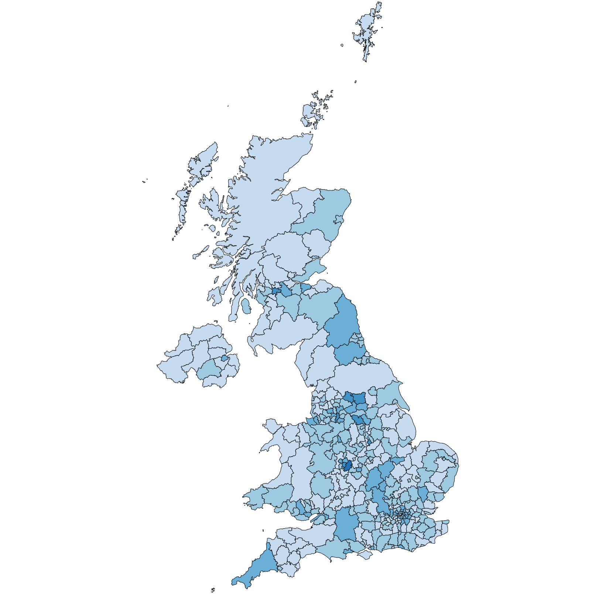

# D3 choropleth demo.

Just a hacky d3 demo choropleth.  A long way from production quality!

### Get boundaries as geojson 

e.g. from [ONS geo portal](https://geoportal.statistics.gov.uk/datasets/ons::local-authority-districts-may-2023-boundaries-uk-bfe/about)

### transform with mapshaper

[Mapshaper]([https://mapshaper.org](https://github.com/mbloch/mapshaper))

e.g.
```
mapshaper -i districts.geojson \
-proj from=EPSG:27700 crs=EPSG:4326 \
-simplify 1% \
-o precision=0.0001 format=geojson mapshaped-districts.geojson
```

### Get a 1D CSV slice of data from somewhere. 

e.g. From [NOMIS: ](https://www.nomisweb.co.uk/)

e.g [Jobseeker's Allowance by age and duration](https://www.nomisweb.co.uk/datasets/ucad)

[Filtered CSV](https://www.nomisweb.co.uk/api/v01/dataset/NM_4_1.data.csv?geography=1811939329...1811939332,1811939334...1811939336,1811939338...1811939428,1811939436...1811939442,1811939768,1811939769,1811939443...1811939497,1811939499...1811939501,1811939503,1811939505...1811939507,1811939509...1811939517,1811939519,1811939520,1811939524...1811939570,1811939575...1811939599,1811939601...1811939628,1811939630...1811939634,1811939636...1811939647,1811939649,1811939655...1811939664,1811939667...1811939680,1811939682,1811939683,1811939685,1811939687...1811939704,1811939707,1811939708,1811939710,1811939712...1811939717,1811939719,1811939720,1811939722...1811939730,1811939757...1811939767&date=latest&sex=7&age_dur=MAKE|Aged%2018-24|3;4;5&measures=20100&select=date_name,geography_name,geography_code,age_dur_name,sex_name,measures_name,obs_value,obs_status_name).

### View map.html in a browser 

You'll need to run this on a webserver for it to work. e.g. `python3 -m http.server`.

http://localhost:8080/map.html




## Disclaimers / TODO:

* The code isn't very idiomatic d3: just proving the concept.
* Doesn't consider different binning strategies - this is just hardcoded with little thought for now.
* Map needs a legend / title
* Doesn't consider printing to PDF yet.

## Data licence
Source: Office for National Statistics licensed under the Open Government Licence v.3.0
